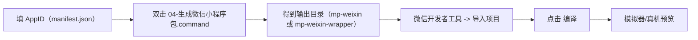
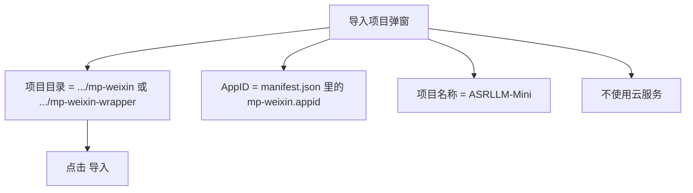

# 微信开发者工具导入图文指南（零基础）

适用人群：没有开发经验，只需要把小程序跑起来做调试。  
适用项目目录：`/Users/zhangxiyuan/VSCode/ASRLLM`

## 1. 一图看流程



## 2. 前置准备

1. 已安装微信开发者工具（电脑端）。
2. 你有一个可用的小程序 AppID（测试号或正式号都可以）。
3. 已成功运行过一次 `00-首次安装.command`。

## 3. 第一步：填写 AppID（必须）

打开文件：
`apps/mini/src/manifest.json`

找到这段，把 `wx-demo-appid` 改成你的真实 AppID：

```json
"mp-weixin": {
  "appid": "你的真实AppID",
  "setting": {
    "urlCheck": false
  }
}
```

如果不改，`04-生成微信小程序包.command` 会直接报错并停止。

## 4. 第二步：双击生成小程序包

双击：
`scripts/easy/04-生成微信小程序包.command`

成功后会看到：
1. 当前 AppID
2. 生成完成提示
3. 输出目录（可能是 `apps/mini/dist/build/mp-weixin` 或 `apps/mini/dist/build/mp-weixin-wrapper`）

## 5. 第三步：在微信开发者工具导入项目

打开微信开发者工具后，点击 `导入项目`，按下面填写：

| 字段 | 填写内容 |
|---|---|
| 项目目录 | 第 4 步脚本输出的目录（例如 `.../apps/mini/dist/build/mp-weixin` 或 `.../apps/mini/dist/build/mp-weixin-wrapper`） |
| AppID | 与 `manifest.json` 一致的真实 AppID |
| 项目名称 | `ASRLLM-Mini`（可自定义） |
| 后端服务 | 选择“不使用云服务” |

图示（字段关系）：



## 6. 第四步：编译并验证

1. 导入成功后点击顶部 `编译`。
2. 左侧模拟器出现页面，即表示小程序端已运行。
3. 如果导入的是 `mp-weixin-wrapper`，请先点击页面里的“打开训练页面”按钮。
4. 如需录音能力，建议继续做真机预览。

## 7. 真机预览（可选）

1. 微信开发者工具右上角点击 `预览`。
2. 用手机微信扫码。
3. 手机里打开后进行录音/流程验证。

## 8. 常见问题

### 8.1 提示找不到 `app.json`

原因：导入目录选错。  
处理：必须选择脚本输出的 `mp-weixin` 目录，不是仓库根目录。

### 8.2 提示 AppID 非法

原因：AppID 填错或仍是 `wx-demo-appid`。  
处理：改 `apps/mini/src/manifest.json` 后，重新执行 `04-生成微信小程序包.command`。

### 8.3 页面能打开，但接口请求失败

常见原因：小程序里当前 API 地址是本机地址（`localhost`），手机无法访问。  
处理建议：
1. 将 `apps/mini/src/api/client.ts` 的 `API_BASE` 改成局域网或内网可访问地址。
2. 开发者工具里临时勾选“不校验合法域名”（仅开发调试阶段）。

### 8.4 生成结果是 `mp-weixin-wrapper`

这是脚本自动启用的兼容模式（web-view 调试壳），用于保证零基础用户可以直接导入调试。  
使用要点：
1. 先双击 `01-启动系统.command`，确保 `http://127.0.0.1:5173` 可访问。
2. 在微信开发者工具里点击“打开训练页面”进入联调。
